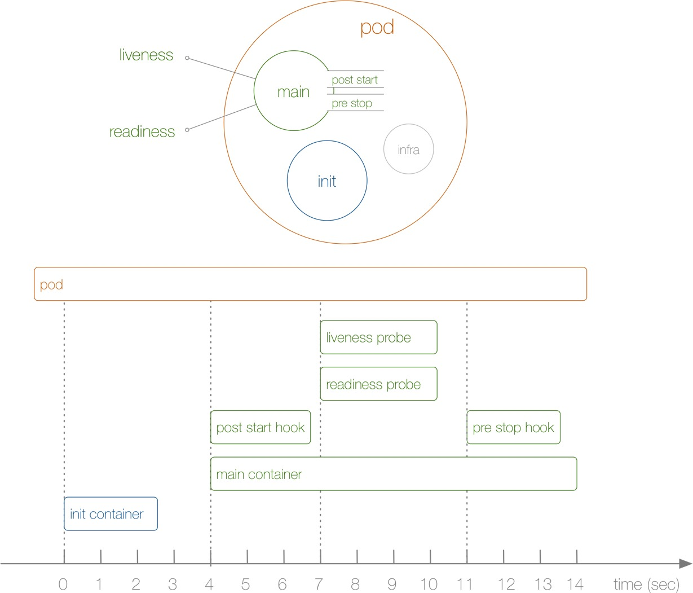

# POD原理-生命周期
# POD
-------
kubernets最基本的调度单元
## 为什么需要POD
将多个容器绑定在一起，并将他们作为一个基本的调度单元进行管理，保证这些容器始终在同一个节点上
## POD原理
在一个POD下运行几个关系非常密切的容器进程，
POD是一个逻辑概览，底层还是Namespace和Cgroup，Pod被创建出来，实际上是一组共享一些资源的容器，使用同一个Network Namespace，但是文件系统是完全隔离的

在启动应用容器前，一般会启动一个Infra容器，也就是pause这个镜像
可以通过命令查看相关配置
```
 systemctl status kubelet
● kubelet.service - kubelet: The Kubernetes Node Agent
   Loaded: loaded (/usr/lib/systemd/system/kubelet.service; enabled; vendor preset: disabled)
  Drop-In: /usr/lib/systemd/system/kubelet.service.d
           └─10-kubeadm.conf
   Active: active (running) since 一 2023-07-10 17:02:55 CST; 5h 36min ago
     Docs: https://kubernetes.io/docs/
 Main PID: 11778 (kubelet)
    Tasks: 11
   Memory: 61.8M
   CGroup: /system.slice/kubelet.service
           └─11778 /usr/bin/kubelet --bootstrap-kubeconfig=/etc/kubernetes/bootstrap-kubelet.conf --kubeconfig=/etc/kubernetes/kubelet.conf --config=/var/lib/kubelet/config.yaml --container-runtime-endpoint=unix:///var/run/co...

[root@master k8s]# cd /usr/lib/systemd/system/kubelet.service.d
[root@master kubelet.service.d]# cat 10-kubeadm.conf
# Note: This dropin only works with kubeadm and kubelet v1.11+
[Service]
Environment="KUBELET_KUBECONFIG_ARGS=--bootstrap-kubeconfig=/etc/kubernetes/bootstrap-kubelet.conf --kubeconfig=/etc/kubernetes/kubelet.conf"
Environment="KUBELET_CONFIG_ARGS=--config=/var/lib/kubelet/config.yaml"
# This is a file that "kubeadm init" and "kubeadm join" generates at runtime, populating the KUBELET_KUBEADM_ARGS variable dynamically
EnvironmentFile=-/var/lib/kubelet/kubeadm-flags.env
# This is a file that the user can use for overrides of the kubelet args as a last resort. Preferably, the user should use
# the .NodeRegistration.KubeletExtraArgs object in the configuration files instead. KUBELET_EXTRA_ARGS should be sourced from this file.
EnvironmentFile=-/etc/sysconfig/kubelet
ExecStart=
ExecStart=/usr/bin/kubelet $KUBELET_KUBECONFIG_ARGS $KUBELET_CONFIG_ARGS $KUBELET_KUBEADM_ARGS $KUBELET_EXTRA_ARGS
[root@master kubelet.service.d]# cat /var/lib/kubelet/kubeadm-flags.env
KUBELET_KUBEADM_ARGS="--container-runtime-endpoint=unix:///var/run/containerd/containerd.sock --pod-infra-container-image=registry.cn-hangzhou.aliyuncs.com/google_containers/pause:3.9"
[root@master kubelet.service.d]#

```
Infra容器启动后，同一个pod下的其他容器也加入了Infra容器下的network namespace,这样普通容器就不会创建网卡，而和Infra容器共享IP 端口等网络信息，不同容器通过lo网卡进行通信
- 容器之间可以直接使用localhost通信
- 看到的网络设备和infra相同
- 同一个pod下的容器不能绑定同一个端口
- pod生命周期和infra容器相关

## Volum
默认情况下，容器的文件系统互相隔离，可以通过在POD顶层声明一个Volume，在需要共享Volume的容器中生命挂载
```
apiVersion: v1
kind: Pod
metadata:
  name: counter
  namespace: default
  labels:
   app: pod-counter
spec:
  containers:
  - name: pod-counter
    image: busybox
    args: 
    - bin/sh
    - -c
    - >
      i=0;
      while true;
      do
        echo "$i:$(date)" >> /var/log/1.log;
        i=$((i+1));
        sleep 1;
      done
    volumeMounts:
      - name:  logvol
        mountPath:  /var/log
  - name: counter-pod
    image: busybox
    args:
    - bin/sh
    - -c
    - 'tail -n+1 -f /opt/log/1.log'
    volumeMounts:  #挂载
      - name:  logvol
        mountPath:  /opt/log
  volumes: #声明volumes
    - name:  logvol
      hostPath:
        path:  /root/k8s/varlog
```
## 如何划分POD
如何定义关系紧密？
如wordpress，需要前端服务和后端服务，那需要一个pod还是两个pod？
可以但是没必要。不建议这么做
如果在一起，扩容的时候数据库中的数据会完全隔离开。建议数据库和应用服务单独放在不同的POD中。这样不论是数据库扩容还是应用扩容，都不会影响

当我们判断是否要需要在Pod中使用多个容器时，按下面几个方式来判断：
- 容器是否一定需要一起运行，是否可以运行在不同的容器上
- 容器是否是一个整体，还是独立的组件
- 容器一起进行扩容时，会影响应用吗？

可以把Pod看出虚拟机，容器就是虚拟机中运行的程序。

## POD的生命周期

POD的生命周期主要保护`Init Container`、`Pod Hook`、`健康检查`三部分
### POD状态
PodStatus  可以通过 `kubectl explain pod.status`查看Pod状态的信息
- 挂起(Pending)：Pod信息提交给集群，但是还没有被调度器调度到合适的节点或者Pod里的镜像正在下载
- 运行(Running)：Pod绑定到了一个节点上，Pod中所有容器都以及被创建，至少有一个容器正在运行或者正处于启动或者重启状态
- 成功(Succeeded)：Pod中所有容器都被成功终止，并且不会再重启
- 失败(Failed)：Pod所有容器都终止，且至少有一个容器因为失败终止。容器以非0状态退出或者被系统终止
- 未知(Unknown)：因为某些原因无法取得Pod状态，通常是因为Pod所在主机通信失败
除了PodStatus，还有PodCondition

### 重启策略
restartPolicy，可能值是`Always`,`Never`,`OnFailure`,默认为`Always`。
restartPolicy仅指 通过kubelet在同一节点上重启容器。kubelet重启的退出容器将以指数增加延迟（10s,20s,40s……）重新启动，上限为5分钟，在成功执行10分钟后重置。不同控制器可以控制Pod的重启策略
- Job:适用于一次性任务。任务结束后Pod会被此类控制器清除。Job的重启策略只能是`OnFailure`和`Never`
- Replication Controller,ReplicaSet,Deployment：此类控制器一般希望一直运行下去，重启策略一般都是`Always`
- DaemonSet：每个节点启动一个Pod，也是`Always`

### 初始化容器 Init container
用来初始化的容器，有一个或者多个，如果有多个的时候按定义的顺序一次执行。
`Init Container`产生的数据可以被主容器用到，一般独立与主容器之外，只有所有的`初始化容器执行完之后，主容器才会被启动`
- 等待其他模块Ready：如Web服务，依赖于数据库服务，需要数据库服务正常后web服务再启动。可以使用`Init Container`检查数据库容器是否准备好，准备好了初始化容器就可以退出了
- 初始化配置：
- 其他：将Pod注册到中央数据库，配置中心等

下面以Nginx的POD为例，启动ng前先下载百度首页
```
apiVersion: v1
kind: Pod
metadata:
  name: init-pod
  namespace: default
  labels:
    app: init-pod
spec:
  volumes:
    - name:  workdir
      emptyDir: {}
  initContainers:
    - name: init
      image: busybox
      command:
        - wget
        - "-O"
        - "/work-dir/index.html"
        - http://www.baidu.com
      volumeMounts:
        - name:  workdir
          mountPath:  /work-dir 
  containers:
    - name: ng
      image: nginx:latest
      ports:
      - name:  ng-ports
        containerPort: 80
      volumeMounts:
        - name:  workdir
          mountPath: /usr/share/nginx/html

---
apiVersion: v1
kind: Service
metadata:
  name: init-demo
  namespace: default
spec:
  selector:
    app: init-pod
  type: NodePort
  sessionAffinity: None
  sessionAffinityConfig:
    clientIP:
      timeoutSeconds: 10800
  ports:
  - name: init-demo
    protocol: TCP
    port: 8088
    targetPort: 80
    # If you set the `spec.type` field to `NodePort` and you want a specific port number,
    # you can specify a value in the `spec.ports[*].nodePort` field.
    nodePort: 31505
```

### Pod Hook
Kubernetes为容器提供了生命周期的钩子，也就是Pod Hook。由kubelet发起，当容器中的进程启动前或容器中的进程终止前运行，包含在容器的生命周期之中。可以同时为Pod中所有的容器都配置Pod Hook
两种钩子函数
- PostStart
容器创建后立即执行。但是，并不能保证钩子将在容器 ENTRYPOINT 之前运行，因为没有参数传递给处理程序。主要用于资源部署、环境准备等。不过需要注意的是如果钩子花费太长时间以至于不能运行或者挂起，容器将不能达到 running 状态。
- PreStop
容器终止前立即调用。它是阻塞的，意味着它是同步的，所以它必须在删除容器的调用发出之前完成。主要用于优雅关闭应用程序、通知其他系统等。如果钩子在执行期间挂起，Pod 阶段将停留在 running 状态并且永不会达到 failed 状态。

如果`PostStart`或者`ProStop`钩子失败，会杀死容器。所以让钩子尽量轻量。

两种方式实现上面的钩子函数
- Exec
用于执行一段特定的命令，不过该命令的消耗会被计入容器
- HTTP
对容器上特定的端点执行HTTP请求

定义一个NginxPod,其中设置了PostStart，即在容器创建成功后，写入一句话到/usr/share/message/中
`post-postStart.yaml`
```yaml
apiVersion: v1
kind: Pod
metadata:
  name: hook-demo
  labels:
    app: hook-demo
  namespace: default
spec:
  containers:
    - name: ng-hook-demo
      image: nginx
      ports:
        - containerPort: 80
      lifecycle:
        postStart:
          exec:
            command:
              - /bin/sh
              - -c
              - "echo hello from postStart handler > /usr/share/nginx/html/hello.html"


[root@master k8s]# kubectl get pod -o wide
NAME                            READY   STATUS    RESTARTS        AGE   IP            NODE    NOMINATED NODE   READINESS GATES
hook-demo                       1/1     Running   0               46s   10.244.8.22   node1   <none>           <none>
init-demo                       1/1     Running   0               52m   10.244.8.20   node1   <none>           <none>
init-pod                        1/1     Running   0               48m   10.244.7.21   node2   <none>           <none>
nginx-dep-7fd5c9d6fd-6m7mj      1/1     Running   3 (6h12m ago)   42h   10.244.8.15   node1   <none>           <none>
nginx-dep-7fd5c9d6fd-pwm5r      1/1     Running   3 (6h12m ago)   42h   10.244.7.16   node2   <none>           <none>
nginx-deploy-7b476c457c-8rvb9   1/1     Running   3 (6h12m ago)   43h   10.244.7.15   node2   <none>           <none>
nginx-deploy-7b476c457c-qqbct   1/1     Running   3 (6h12m ago)   43h   10.244.8.16   node1   <none>           <none>
[root@master k8s]# curl 10.244.8.22/hello.html
hello from postStart handler

```

command和args有什么区别？
command --> entrypoint,容器执行的命令
args --> cmd，传给命令的参数
- 如果容器中没有设置command或者args，那么会使用镜像自带的命令及参数
- 如果容器中配置了command没有设置args，那么容器启动时只会执行command，镜像中的命令和参数都会被忽略
- 如果容器中值配置了args，那么镜像中自带的命令会使用容器的args作为执行的参数
- 如果同时配置了command和args，那么执行command命令和args参数


当用户删除含有Pod资源时，K8S为了让应用程序优雅关闭，提供了两种信息通知
- 默认：K8S通过node执行stop命令，容器运行时会向容器中PID为1的进程发送`SIGTRM`信号，然后等待容器中的应用程序终止执行，如果等待时间达到设定的超时时间，或者默认超时时间（30s），会继续发送 `SIGKILL` 的系统信号强行 kill 掉进程
- 使用Pod生命周期（利用proStop），它在发送信号之前执行

默认所有的优雅退出时间都是30S，`kubectl delete `命令支持` --grace-period=<seconds>` 选项，这个选项允许用户用他们自己指定的值覆盖默认值，值0代表强制删除 pod。 在 kubectl 1.5 及以上的版本里，执行强制删除时必须同时指定` --force --grace-period=0`。

定义一个Nginx pod，设置一个preStop钩子，即在容器退出前，优雅的关闭nginx （pod-prestop.yaml)
### 健康检查
`liveness probe`（存活探针）和`readiness probe`（可读性探针）
- `liveness probe`确定应用程序是否正在运行。是容器进程在存在bug的情况下依然能够继续运行下去
- `readiness probe` 确定容器是否已经就绪，可以接受流量。只有POD中的容器都是就绪状态，kubelet才会认定该pod处于就绪状态。如果不处于就绪状态，会将该pod从service的Endpoints列表移除出来，流量不会路由到该pod中
和钩子函数一样，这两种探针支持下面几种配置方式
- exec：执行一段命令
- http：检测某个http请求
- tcpSocket：使用此配置，kubelet将尝试在指定宽口上打开容器的套接字。如果建立连接则认为是健康的

#### livenessProbe 控制Pod本身存活性
`liveness-exec.yaml`
```yaml
apiVersion: v1
kind: Pod
metadata:
  name: liveness-exec
  namespace: default
spec:
  containers:
    - name: liveness-exec
      image: busybox
      args:
      - /bin/sh
      - -c 
      - touch /tmp/healthy; sleep 30; rm -rf /tmp/healthy; sleep 600
      livenessProbe:
        exec:
          command:
            - cat
            - /tmp/healthy
        initialDelaySeconds: 5 #第一次执行探针延迟时间
        periodSeconds: 5 #间隔时间
```

一般使用`HTTP Get`请求来配置存活探针（因为一般都是web服务）`liveness-http.yaml`
```yaml
# liveness-http.yaml
apiVersion: v1
kind: Pod
metadata:
  name: liveness-http
spec:
  containers:
  - name: liveness
    image: cnych/liveness
    args:
    - /server
    livenessProbe:
      httpGet:
        path: /healthz
        port: 8080
        httpHeaders:
        - name: X-Custom-Header
          value: Awesome
      initialDelaySeconds: 3
      periodSeconds: 3
```
在探针中有一个`initialDelaySeconds`属性，用来配置第一次执行探针的等待时间，对于启动非常慢的应用这个参数很有用，但是如何合理的设置这个初始时间？所以在1.16新增了`startupProbe`（启动探针），该探针会推迟所有探针，知道POD完成启动为止
#### startupProbe Pod启动存活性 保护慢启动容器
```yaml
startupProbe:
  httpGet:
    path: /healthz
    port: 8080
  failureThreshold: 30  # 尽量设置大点
  periodSeconds: 10
```

#### readinessProbe  控制Service的endpoint
```yaml
readinessProbe:
  httpGet:
    path: /healthz
    port: 8080
  initialDelaySeconds: 3
  periodSeconds: 3
```