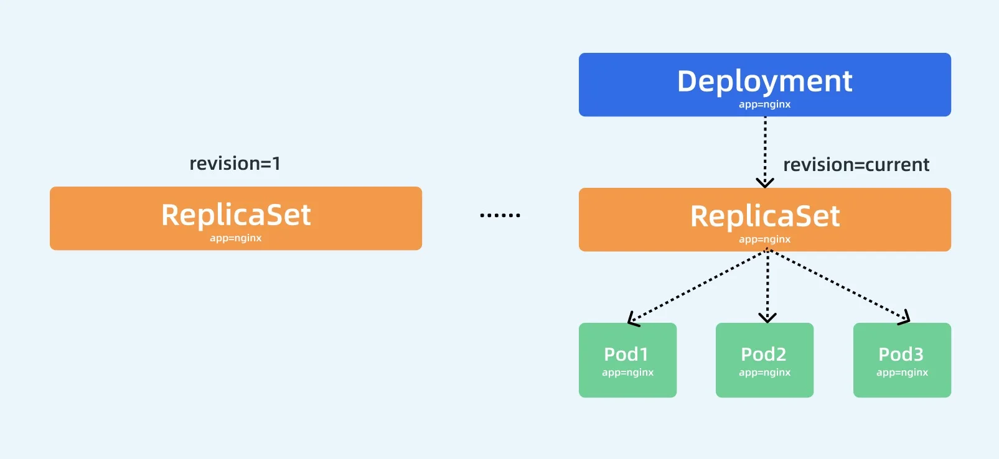
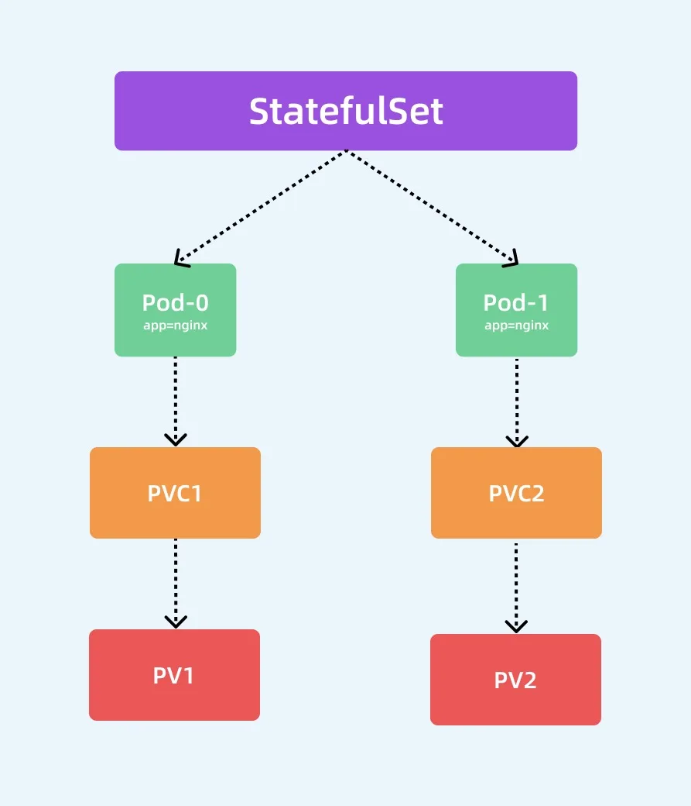
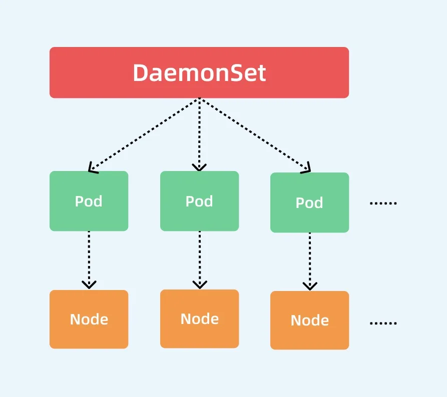

# 05K8S_控制器
控制器会监听资源的创建/更新/删除事件，并触发reconcile函数作为响应，整个调整过程被称作`Reconcile Loop调谐循环`或者`sync lool 同步循环`。reconcile函数使资源的实际状态与资源清单中定义的状态保持一致。调用完成后，Reconcile会将资源对象的状态更新为当前实际的状态。
## ReplicaSet
维持一组Pod副本的运行，保证议数量的Pod在集群中正常运行。ReplicaSet 控制器会持续监听它所控制的这些 Pod 的运行状态，在 Pod 发送故障数量减少或者增加时会触发调谐过程，始终保持副本数量一定。
```yaml
##nginx-rs.yaml
apiVersion: apps/v1
kind: ReplicaSet
metadata:
  name: ng-rs
spec:
  replicas: 3
  selector: # 必须 Label Selector
    matchLabels:
      replicaset: test
  template: # Pod模板
    metadata:
      name: ng-pod
      labels:
        replicaset: test
    spec:
      containers:
        - image:  nginx
          name:  ng-c
          ports:
          - containerPort: 80
```
`selector` 属性，Label Selector，会通过自定义的标签去匹配集群中的Pod对象

## Deployment
Deployment是replicaSet的上层控制器，Deployment 一个非常重要的功能就是实现了 Pod 的滚动更新，做到不中断服务
```ngingx-dep
apiVersion: apps/v1
kind: Deployment
metadata:
  name: ng-dep
  labels:
    app: ng-dep
spec:
  replicas: 4
  selector:
    matchLabels:
      dep: ng-dep-pod
  template:
    metadata:
      name: ng-dep-rs
      labels:
        dep: ng-dep-pod
    spec:
      containers:
      - name:  ng-c-dep
        image:  nginx
        ports:
        - containerPort:  80
```
deployment中，Pod由rs控制，而RS有deployment控制

Deployment中的ReplicaSet 作用和单RS控制器一样用保证 Pod 的个数始终保存指定的数量，所以 Deployment 中的容器 `restartPolicy=Always`这个参数始终都是这样，因为容器一直处于ruuning状态，RS才可以调整Pod状态和个数。Deployment 通过管理 ReplicaSet 的数量和属性来实现水平扩展/收缩以及滚动更新两个功能的。
### 水平扩展/伸缩
通过`kubectl scale`来完整水平扩展/伸缩
```sh
[root@master 02controller]# kubectl scale deployment ng-dep --replicas=3
deployment.apps/ng-dep scaled
[root@master 02controller]# kubectl get deployments.apps ng-dep 
NAME     READY   UP-TO-DATE   AVAILABLE   AGE
ng-dep   3/3     3            3           13m
[root@master 02controller]# kubectl scale deployment ng-dep --replicas=4
deployment.apps/ng-dep scaled
[root@master 02controller]# kubectl get deployments.apps ng-dep
NAME     READY   UP-TO-DATE   AVAILABLE   AGE
ng-dep   3/4     4            3           14m
[root@master 02controller]# kubectl get deployments.apps ng-dep
NAME     READY   UP-TO-DATE   AVAILABLE   AGE
ng-dep   4/4     4            4           14m
[root@master 02controller]# kubectl scale deployment ng-dep --replicas=3
deployment.apps/ng-dep scaled
[root@master 02controller]# kubectl get deployments.apps ng-dep
NAME     READY   UP-TO-DATE   AVAILABLE   AGE
ng-dep   3/3     3            3           14m
```
查看deployment的事件
```
[root@master 02controller]# kubectl describe deployments.apps ng-dep
……
Events:
  Type    Reason             Age                  From                   Message
  ----    ------             ----                 ----                   -------
  Normal  ScalingReplicaSet  15m                  deployment-controller  Scaled up replica set ng-dep-6b558d4747 to 4
  Normal  ScalingReplicaSet  64s (x2 over 2m18s)  deployment-controller  Scaled down replica set ng-dep-6b558d4747 to 3 from 4
  Normal  ScalingReplicaSet  61s (x2 over 79s)    deployment-controller  Scaled up replica set ng-dep-6b558d4747 to 4 from 3
```
### 滚动更新
`deployment.spec.spec.type`
```
strategy:
  type: RollingUpdate
  rollingUpdate:
    maxSurge: 1
    maxUnavailable: 1
```
- type=RollingUpdate：表示设置更新策略为滚动更新，可以设置为Recreate和RollingUpdate两个值，Recreate表示全部重新创建，默认值就是RollingUpdate。
- maxSurge：表示升级过程中最多可以比原先设置多出的 Pod 数量，默认25%。例如：maxSurage=1，replicas=5，就表示 Kubernetes 会先启动一个新的 Pod，然后才删掉一个旧的 Pod，整个升级过程中最多会有5+1个 Pod。
- maxUnavaible：表示升级过程中最多有多少个 Pod 处于无法提供服务的状态，当maxSurge不为 0 时，该值也不能为 0，默认25%。例如：maxUnavaible=1，则表示 Kubernetes 整个升级过程中最多会有 1 个 Pod 处于无法服务的状态。

可以通过`rollout history`查看更新历史
`rollout history` 中记录的 `revision `是和` ReplicaSets` 一一对应。如果我们手动删除某个 `ReplicaSet`，对应的`rollout history`就会被删除，也就是1无法回滚到个revison了
`kubectl rollout history deployment nginx-deploy --revision=1`可以查看某个版本的详细信息
假设现在要回退到当前版本的前一个版本，可以直接用如下命令
`kubectl rollout undo dep ng-dep`
也可以回到指定的`revision`版本  
`kubectl rollout undo dep ng-deo --to-revision=2`
> 默认情况下会为我们暴露下所有滚动升级的历史记录，也就是 ReplicaSet 对象，但一般情况下没必要保留所有的版本，毕竟会存在 etcd 中，我们可以通过配置 spec.revisionHistoryLimit 属性来设置保留的历史记录数量，不过新版本中该值默认为 10，如果希望多保存几个版本可以设置该字段。

## StatefulSet
deploymen对无状态服务，但是对有状态服务就无能无力了，所以什么是有状态服务什么又是无状态服务？
- 无状态服务(Statekess Service)
服务运行的示例不会在本地存储需要持久化的数据，多个实例对通过一个请求的响应的结果都是一直的。
- 有状态服务(Stateful Service)
服务运行的实例需要在本地存储持久化数据，比如数据库。

StatefulSet类似RepliacaSet，但是可以处理Pod的启动顺序，为保留每个Pod的状态设置唯一标识，具有如下几个功能特性：
- 稳定唯一的网络标识符
- 稳定持久化的存储
- 有序优雅的部署和缩放
- 有序优雅的删除和终止
- 有序的、自动滚动更新

### Headless Service
Service是应用服务的抽象，通过Labels为应用提供负载均衡和服务发现，每个service会自动分配一个cluster IP和DNS名，内部可以通过该地址或者FDQN的形式访问服务。定义一个service后，有两种方式访问这个service
- cluster 
- service的DNS方式，比如  `mysvc.mynamespace.svc.cluster.local`
对应DNS这种方式实际上也有两种情况
- 普通的service，比如访问`mysvc.mynamespace.svc.cluster.local`就是通过集群中的DNS服务解析到mysvc这个service的clusterIP的
- Headless Service。这种情况下，访问`mysvc.mynamespace.svc.cluster.local`的时候直接解析到mysvc代理的某一个具体的Pod的IP地址，少了cluster IP的转发。
两者区别：Headless service不需要分配一个VIP，可以直接通过DNS的记录方式解析到后面的POD IP地址
headless-svc.yaml
```yaml
apiVersion: v1
kind: Service
metadata:
  name: nginx
  namespace: default
  labels:
    app: nginx
spec:
  ports:
    - name: http
      port: 80
  clusterIP: None  #ClusterIP 为None，即为Headless Service
  selector:
    app: nginx
```
Headless Service 在定义上和普通的 Service 几乎一致, 只是他的 clusterIP=None，创建后不会被分配clusterIP，而是会以DNS记录的方式暴露出所代理的Pod。对于 Headless Service 所代理的所有 Pod 的 IP 地址都会绑定一个如下所示的 DNS 记录：
`<pod-name>.<svc-name>.<namespace>.svc.cluster.local`
这个 DNS 记录正是 Kubernetes 集群为 Pod 分配的一个唯一标识，只要知道 Pod 的名字，以及它对应的 Service 名字，就可以组装出这样一条 DNS 记录访问到 Pod 的 IP 地址。
### StatefulSet
开始之前 需要准备两个存储卷（pv）
```yaml
apiVersion: v1
kind: PersistentVolume
metadata:
  name: pv001
spec:
  accessModes:
  - ReadWriteOnce
  capacity:
    storage: 1Gi
  hostPath:
    path: /tmp/pv001
---
apiVersion: v1
kind: PersistentVolume
metadata:
  name: pv002
spec:
  accessModes:
  - ReadWriteOnce
  capacity:
    storage: 1Gi
  hostPath:
    path: /tmp/pv002
```
接下来就可以创建StatefulSet的资源清单了(ngix-sts.yaml)
```yaml
apiVersion: apps/v1
kind: StatefulSet
metadata:
  name: ng-headless
spec:
  selector:
    matchLabels:
      app: ng-headless
  serviceName: "ng-headless-svc"
  replicas: 2
  template:
    metadata:
      labels:
        app: ng-headless
    spec:
      containers:
      - name: ng-headless-c
        image: nginx
        ports:
        - containerPort: 80
          name: web
        volumeMounts:
        - name: vol
          mountPath: /usr/share/nginx/html
  volumeClaimTemplates:
  - metadata:
      name: vol
    spec:
      accessModes: [ "ReadWriteOnce" ]
      resources:
        requests:
          storage: 1Gi
```
和deployment基本一致，通过声明Pod模板来创建Pod。区别是和volumeMonuts关联的不是volumes而是`volumeClaimTemplates`，这个属性会自动创建一个pvc对象，pvc被创建后就会和系统中与他合适的PV绑定。另外还多了一个`serviceName:ng-headless-svc`，也就是管理statefulSet的服务名称。这个服务必须存在，负责该集合的网络标识。Pod会按照一下格式获取DNS/主机名：pod-specific-string.servicename.default.svc.cluster.local。pod-specific-string有StatefulSet控制器管理

创建`ng-headless-svc`：
```yaml
apiVersion: v1
kind: Service
metadata:
  name: ng-headless-svc
spec:
  selector: #这个标签和pod标签保持一致
    app: ng-headless
  ports:
  - port: 8080
    targetPort: 80
  clusterIP: None #
```
创建完成后就可以创建对应的statefulSet对象了。
```sh
[root@master statefullset]# kubectl get pod -l app=ng-headless -o wide
NAME            READY   STATUS    RESTARTS   AGE   IP            NODE    NOMINATED NODE   READINESS GATES
ng-headless-0   1/1     Running   0          68s   10.244.7.73   node2   <none>           <none>
ng-headless-1   1/1     Running   0          64s   10.244.8.73   node1   <none>           <none>

[root@master statefullset]# kubectl get pvc -o wide
NAME                STATUS   VOLUME   CAPACITY   ACCESS MODES   STORAGECLASS   AGE     VOLUMEMODE
vol-ng-headless-0   Bound    pv001    1Gi        RWO                           6m41s   Filesystem
vol-ng-headless-1   Bound    pv002    1Gi        RWO                           58s     Filesystem

[root@master statefullset]# kubectl get pv -o wide
NAME    CAPACITY   ACCESS MODES   RECLAIM POLICY   STATUS   CLAIM                       STORAGECLASS   REASON   AGE    VOLUMEMODE
pv001   1Gi        RWO            Retain           Bound    default/vol-ng-headless-0                           106s   Filesystem
pv002   1Gi        RWO            Retain           Bound    default/vol-ng-headless-1                           106s   Filesystem

[root@master statefullset]# kubectl get svc -o wide
NAME              TYPE        CLUSTER-IP    EXTERNAL-IP   PORT(S)          AGE     SELECTOR
kubernetes        ClusterIP   10.96.0.1     <none>        443/TCP          6d3h    <none>
ng-headless-svc   ClusterIP   None          <none>        8080/TCP         77s     app=ng-headless
nginx-deploy      NodePort    10.99.227.2   <none>        8080:31555/TCP   5d23h   app=nginx-deploy

[root@master statefullset]# kubectl get sts -o wide
NAME          READY   AGE   CONTAINERS      IMAGES
ng-headless   2/2     82s   ng-headless-c   nginx
```
创建完成后，会发现之前创建的pv和pvc绑定了。
另外statefulset中的两个pod名称，和这两个Pod的hostname一致
> StatefulSet 中 Pod 副本的创建会按照序列号升序处理，副本的更新和删除会按照序列号降序处理。
创建一个镜像并进入，通过nslookup解析
```sh
[root@master statefullset]# kubectl run -it --rm --restart=Never --image=infoblox/dnstools:latest dnstool
If you don't see a command prompt, try pressing enter.
dnstools# nslookup
> ng-headless-svc
Server:         10.96.0.10
Address:        10.96.0.10#53
Name:   ng-headless-svc.default.svc.cluster.local
Address: 10.244.7.73
Name:   ng-headless-svc.default.svc.cluster.local
Address: 10.244.8.73
dnstools# curl ng-headless-svc
node1 index.html
dnstools# curl ng-headless-svc
node2 index.html
```
通过`headless svc`这个svc的名称，就可以访问到两个不同节点的node。访问不同是因为做了持久化，将两个节点对应的文件做了修改
这样的可以实现，就算删除了statefulSet下的某个pod，虽然Pod IP改变了，但是仍可以通过svc来访问，关联以前的svc。
通过`headless service`，StatefulSet保证了网络标识的唯一稳定性。由于Pod IP并不固定。访问有状态实例时，必须用DNS记录的方式来访问。
在删除StatefulSet对象时，删除的顺序是按照对应Pod名称标号倒序删除的。
#### 管理策略
StatefulSet的顺序性是不必要的，可以在声明StatefulSet是设置`spec.podManagementPolicy`的策略即可改变
默认的管理策略是`OrderedReady`，即遵循之前的顺序，还可以设置成 `Parallel`，表示并行的终止所有Pod，在启动或终止另一个 Pod 前，不必等待这些 Pod 变成 Running 和 Ready 或者完全终止状态。
#### 更新策略
statefulSet支持两种升级策略：`RollingUpdate`和`onDelete`。可以通过`spec.updateStrategy.type`指定
- OnDelete：只有手动删除旧的 Pod 才会创建新的 Pod
- RollingUpdate：滚动更新。如果错误就会停止，需要注意 StatefulSet 的 Pod 在部署时是顺序从 0~n 的，而在滚动更新时，这些 Pod 则是按逆序的方式即 n~0 一次删除并创建。

StatefuSet的滚动更新还支持`Partitions`的特性，可以通过`spec.updateStrategy.rollingUpdate.partition` 进行设置。StatefulSet中Pod序号大于等于partition的pod才会进行升级，其余Pod不变，这样实现了灰度发布。

> PS：实际的项目中，其实我们还是很少会去直接通过 `StatefulSet` 来部署我们的有状态服务的，除非能够完全能够 hold 住，对于一些特定的服务，我们可能会使用更加高级的 Operator 来部署，比如 `etcd-operator`、`prometheus-operator `等等，这些应用都能够很好的来管理有状态的服务，而不是单纯的使用一个 StatefulSet 来部署一个 Pod 就行，因为对于有状态的应用最重要的还是数据恢复、故障转移等等。

## DaemonSet
部署守护进程。也就是每个节点都部署一个Pod。当节点加入集群时就会被调度到该节点上，节点从集群中移除时，Pod也会被移除。
- 集群存储守护程序，如glusterd，ceph要部署在每个节点上以提供持久性存储
- 节点监控守护进程，如Prometheus监控集群，需要在每个节点都运行一个node-exporter进程收集监控节点的信息
- 日志收集守护进程，如fluentd、logstash。
- 节点网络插件，如flannel、calico

正常情况下，Pod运行在哪个节点由调度器决定，但是DaemonSet控制器创建的Pod实际上已经提前确定了在哪个节点上创建（Pod创建时制定了.spec.nodeName)。所以
- DaemonSet不关心节点的Unshedulable字段
- DaemonSet可以创建Pod，即使调度器都没有启动

ng-ds.yaml
```yaml
apiVersion: apps/v1
kind: DaemonSet
metadata:
  name: ng-ds
spec:
  selector:
    matchLabels:
      ds-app: ng-ds
  template:
    metadata:
      labels:
        ds-app: ng-ds
    spec:
      containers:
        - image:  ngingx
          name:  ng-ds-c
          ports:
            - containerPort: 80
```
```sh
[root@master daemonset]# kubectl get pod -o wide -l ds-app=ng-ds
NAME          READY   STATUS    RESTARTS   AGE   IP            NODE    NOMINATED NODE   READINESS GATES
ng-ds-ng4kn   1/1     Running   0          43s   10.244.7.78   node2   <none>           <none>
ng-ds-p2tqc   1/1     Running   0          43s   10.244.8.76   node1   <none>           <none>
```
可以看到除了master，另外两个node都创建了对应的pod，因为 master 节点上默认被打上了污点，所以默认情况下不能调度普通的 Pod 上去

集群中的Pod和Node是一一对应的， DaemonSet 会管理全部机器上的 Pod 副本，负责对它们进行更新和删除。
DaemonSet如何保证每一个节点都有一个Pod？
- 控制器从Etcd获取到Node列表，遍历所有Node
- 根据资源对象定义是否有调度相关的配置，然后分别检查 Node 是否符合要求。
- 在可运行 Pod 的节点上检查是否已有对应的 Pod，如果没有，则在这个 Node 上创建该 Pod；如果有，并且数量大于 1，那就把多余的 Pod 从这个节点上删除；如果有且只有一个 Pod，那就说明是正常情况。
- 