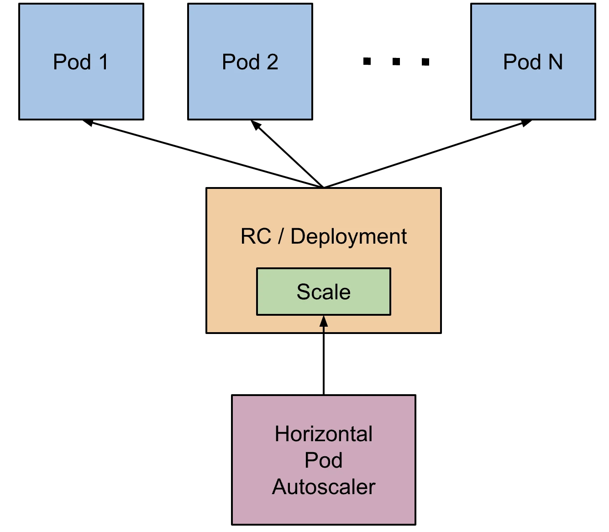
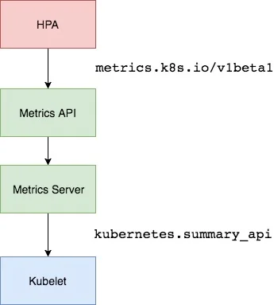

# 06_Job_CornJob_HPA控制器
处理任务，即执行一次的任务，CornJob则是在Job上加了时间调度
## Job
Job-demo.yaml
```yaml
apiVersion: batch/v1
kind: Job
metadata:
  name:  job-demo
spec:
  template:
    metadata:
      name:  name
    spec:
      restartPolicy: "Never"
      containers:
      - name: counter
        image: busybod
        command:
          - /bin/sh
          - "-c"
          - " for i in  9 8 7 6 5 4 3 2 1 ;do echo $i; done"
```
值得注意的是 Job 的 RestartPolicy 仅支持 Never 和 OnFailure 两种，不支持 Always，我们知道 Job 就相当于来执行一个批处理任务，执行完就结束了，如果支持 Always 的话是不是就陷入了死循环了。

当`restartPolicy`设置成Never时，Job任务执行失败时，会不断创建新的Pod，但是不会一直创建下去，会根据 spec.backoffLimit 参数进行限制，默认为6，通过该字段可以定义重建 Pod 的次数，另外需要注意的是 Job 控制器重新创建 Pod 的间隔是呈指数增加的，即下一次重新创建 Pod 的动作会分别发生在 10s、20s、40s… 后。

当设置的 restartPolicy: OnFailure 重启策略，则当 Job 任务执行失败后不会创建新的 Pod 出来，只会不断重启 Pod。

还可以通过设置 spec.parallelism 参数来进行并行控制，该参数定义了一个 Job 在任意时间最多可以有多少个 Pod 同时运行。spec.completions 参数可以定义 Job 至少要完成的 Pod 数目
```
spec:
  parallelism: 2
  completions: 8
```
上述意思是指可以有2个 Pod 同时运行，需要8个 Pod 执行成功，如果不是8个成功，那么会根据 restartPolicy 的策略进行处理，可以认为是一种检查机制。

## CronJob
CronJob就是在Job的基础上，加上了时间调度，可以在给定的时间点运行任务，或者周期性的在给定时间点运行
一个 CronJob 对象其实就对应中 crontab 文件中的一行，它根据配置的时间格式周期性地运行一个 Job，格式和 crontab 也是一样的。
>crontab 的格式为：分 时 日 月 星期 要运行的命令 。
第1列分钟 0～59
第2列小时 0～23
第3列日 1～31
第4列月 1～12
第5列星期 0～7（0和7表示星期天）
第6列要运行的命令

```yaml
apiVersion: batch/v1
kind: CronJob
metadata:
  name: cj-demo
spec:
  schedule: "*/1 * * * *"
  jobTemplate:
    metadata:
      name: cj-demo-tm
    spec:
      template:
        spec:
          restartPolicy: Never
          containers:
            - image:  busybox
              name:  cj-c
              command:
                - date  
```
 
spec.jobTemplate, 用来指定需要运行的任务。
spec.successfulJobsHistoryLimit(默认为3) 和 .spec.failedJobsHistoryLimit(默认为1)，表示历史限制，是可选的字段，指定可以保留多少完成和失败的 Job。当运行一个 CronJob 时，Job 可以很快就堆积很多，所以一般推荐设置这两个字段的值，如果设置限制的值为 0，那么相关类型的 Job 完成后将不会被保留。

```
  Type    Reason            Age                From                Message
  ----    ------            ----               ----                -------
  Normal  SuccessfulCreate  5m16s              cronjob-controller  Created job cj-demo-28157368
  Normal  SawCompletedJob   5m10s              cronjob-controller  Saw completed job: cj-demo-28157368, status: Complete
  Normal  SuccessfulCreate  4m16s              cronjob-controller  Created job cj-demo-28157369
  Normal  SawCompletedJob   4m10s              cronjob-controller  Saw completed job: cj-demo-28157369, status: Complete
  Normal  SuccessfulCreate  3m16s              cronjob-controller  Created job cj-demo-28157370
  Normal  SawCompletedJob   3m9s               cronjob-controller  Saw completed job: cj-demo-28157370, status: Complete
  Normal  SuccessfulCreate  2m16s              cronjob-controller  Created job cj-demo-28157371
  Normal  SawCompletedJob   2m10s              cronjob-controller  Saw completed job: cj-demo-28157371, status: Complete
  Normal  SuccessfulDelete  2m10s              cronjob-controller  Deleted job cj-demo-28157368
  Normal  SuccessfulCreate  76s                cronjob-controller  Created job cj-demo-28157372
  Normal  SawCompletedJob   70s                cronjob-controller  Saw completed job: cj-demo-28157372, status: Complete
  Normal  SuccessfulDelete  70s                cronjob-controller  Deleted job cj-demo-28157369
  Normal  SuccessfulCreate  16s                cronjob-controller  Created job cj-demo-28157373
  Normal  SawCompletedJob   10s (x2 over 10s)  cronjob-controller  Saw completed job: cj-demo-28157373, status: Complete
  Normal  SuccessfulDelete  10s                cronjob-controller  Deleted job cj-demo-28157370
[root@master job]# kubectl get pod | grep cj
cj-demo-28157371-8zm8b    0/1     Completed   0             2m18s
cj-demo-28157372-jtpwh    0/1     Completed   0             78s
cj-demo-28157373-5tc7d    0/1     Completed   0             18s
```
一旦不再需要 CronJob，我们可以使用 kubectl 命令删除它：
`kubectl delete cronjob cj-demo

## HPA
之前在deploymen中，学习了使用`kubectl scale`来实现Pod的扩缩容。但是这个是完全手动操作的，要应对线上的各种复杂情况，我们需要能够做到自动化去感知业务，来自动进行扩缩容。为此，Kubernetes 也为我们提供了这样的一个资源对象：Horizontal Pod Autoscaling（Pod 水平自动伸缩），简称 HPA

我们可以简单的通过` kubectl autoscale `命令来创建一个 HPA 资源对象，HPA Controller 默认30s轮询一次（可通过 `kube-controller-manager` 的`--horizontal-pod-autoscaler-sync-period` 参数进行设置），查询指定的资源中的 Pod 资源使用率，并且与创建时设定的值和指标做对比，从而实现自动伸缩的功能。

### Metrics Server
介绍HPA之前，需要了解一下`Metrics Server`。`Metrics Server`可以标准的K8S API把监控数据暴露出来，有`Metrics Server`后就可以通过标准的`kubernetes API`访问需要获取的监控数据
`https://10.96.0.1/apis/metrics.k8s.io/v1beta1/namespaces/<namespace-name>/pods/<pod-name>`
如上，当访问上面的API时，就可以获取到该Pod的资源数据。这些数据是来自于 kubelet 的 Summary API 采集而来的。不过需要说明的是这里可以通过标准的 API 来获取资源监控数据，并不是因为 Metrics Server 就是 APIServer 的一部分，而是通过 Kubernetes 提供的 Aggregator 汇聚插件来实现的，是独立于 APIServer 之外运行的。

#### 聚合API
Aggregator 允许开发人员编写一个自己的服务，把这个服务注册到 Kubernetes 的 APIServer 里面去，这样我们就可以像原生的 APIServer 提供的 API 使用自己的 API 了，我们把自己的服务运行在 Kubernetes 集群里面，然后 Kubernetes 的 Aggregator 通过 Service 名称就可以转发到我们自己写的 Service 里面去了。这样这个聚合层就带来了很多好处：
- 增加了 API 的扩展性，开发人员可以编写自己的 API 服务来暴露他们想要的 API。
- 丰富了 API，核心 kubernetes 团队阻止了很多新的 API 提案，通过允许开发人员将他们的 API 作为单独的服务公开，这样就无须社区繁杂的审查了。
- 开发分阶段实验性 API，新的 API 可以在单独的聚合服务中开发，当它稳定之后，在合并会 APIServer 就很容易了。
- 确保新 API 遵循 Kubernetes 约定，如果没有这里提出的机制，社区成员可能会被迫推出自己的东西，这样很可能造成社区成员和社区约定不一致。
#### 安装
如果需要使用HPA，需要在集群中安装`Metrics Server`服务。要安装 `Metrics Server` 就需要开启 `Aggregator`，因为 `Metrics Server `就是通过该代理进行扩展的，不过我们集群是通过 Kubeadm 搭建的，默认已经开启了，如果是二进制方式安装的集群，需要单独配置 kube-apsierver 添加如下所示的参数：
```
--requestheader-client-ca-file=<path to aggregator CA cert>
--requestheader-allowed-names=aggregator
--requestheader-extra-headers-prefix=X-Remote-Extra-
--requestheader-group-headers=X-Remote-Group
--requestheader-username-headers=X-Remote-User
--proxy-client-cert-file=<path to aggregator proxy cert>
--proxy-client-key-file=<path to aggregator proxy key>
```
如果 kube-proxy 没有和 APIServer 运行在同一台主机上，那么需要确保启用了如下 kube-apsierver 的参数：
`--enable-aggregator-routing=true`
对于这些证书的生成方式，我们可以查看官方文档：[https://github.com/kubernetes-sigs/apiserver-builder-alpha/blob/master/docs/concepts/auth.md](https://github.com/kubernetes-sigs/apiserver-builder-alpha/blob/master/docs/concepts/auth.md)。

使用kubeadm安装，可以在`kube-apiserver.yaml`中看到已经启用了
```sh
[root@master ~]# cd /etc/kubernetes/manifests/
[root@master manifests]# cat kube-apiserver.yaml
apiVersion: v1
kind: Pod
……
    - --proxy-client-cert-file=/etc/kubernetes/pki/front-proxy-client.crt
    - --proxy-client-key-file=/etc/kubernetes/pki/front-proxy-client.key
    - --requestheader-allowed-names=front-proxy-client
    - --requestheader-client-ca-file=/etc/kubernetes/pki/front-proxy-ca.crt
    - --requestheader-extra-headers-prefix=X-Remote-Extra-
    - --requestheader-group-headers=X-Remote-Group
    - --requestheader-username-headers=X-Remote-User
……
```
接下来就可以安装`Metrics Server`了。
`wget https://github.com/kubernetes-sigs/metrics-server/releases/latest/download/components.yaml`
部署之前需要修改一下镜像地址，或者把镜像地址下载下来，修改tag，以及
```sh
hostNetwork: true  #使用hostNetwork模式
containers:
  image: registry.k8s.io/metrics-server/metrics-server:v0.6.3
```
修改后就可以部署了。部署后pod未正常运行，查看日志
```sh
[root@master HPA]# kubectl get pod -n kube-system -l k8s-app=metrics-server
NAME                              READY   STATUS    RESTARTS   AGE
metrics-server-79b6d98d85-xg74r   0/1     Running   0          62s
[root@master HPA]# kubectl logs -f -n kube-system metrics-server-79b6d98d85-xg74r 
I0716 15:24:13.950373       1 serving.go:342] Generated self-signed cert (/tmp/apiserver.crt, /tmp/apiserver.key)
E0716 15:24:14.519514       1 scraper.go:140] "Failed to scrape node" err="Get \"https://192.168.127.110:10250/metrics/resource\": x509: cannot validate certificate for 192.168.127.110 because it doesn't contain any IP SANs" node="node1"
I0716 15:24:14.521767       1 secure_serving.go:267] Serving securely on [::]:4443
I0716 15:24:14.522318       1 requestheader_controller.go:169] Starting RequestHeaderAuthRequestController
I0716 15:24:14.522372       1 shared_informer.go:240] Waiting for caches to sync for RequestHeaderAuthRequestController
I0716 15:24:14.522439       1 dynamic_serving_content.go:131] "Starting controller" name="serving-cert::/tmp/apiserver.crt::/tmp/apiserver.key"
I0716 15:24:14.522594       1 tlsconfig.go:240] "Starting DynamicServingCertificateController"
W0716 15:24:14.522769       1 shared_informer.go:372] The sharedIndexInformer has started, run more than once is not allowed
I0716 15:24:14.523224       1 configmap_cafile_content.go:201] "Starting controller" name="client-ca::kube-system::extension-apiserver-authentication::client-ca-file"
I0716 15:24:14.523240       1 shared_informer.go:240] Waiting for caches to sync for client-ca::kube-system::extension-apiserver-authentication::client-ca-file
I0716 15:24:14.523275       1 configmap_cafile_content.go:201] "Starting controller" name="client-ca::kube-system::extension-apiserver-authentication::requestheader-client-ca-file"
I0716 15:24:14.523284       1 shared_informer.go:240] Waiting for caches to sync for client-ca::kube-system::extension-apiserver-authentication::requestheader-client-ca-file
E0716 15:24:14.541954       1 scraper.go:140] "Failed to scrape node" err="Get \"https://192.168.127.100:10250/metrics/resource\": x509: cannot validate certificate for 192.168.127.100 because it doesn't contain any IP SANs" node="master"
``` 
因为部署集群的时候，CA 证书并没有把各个节点的 IP 签上去，所以这里 `Metrics Server` 通过 IP 去请求时，提示签的证书没有对应的 IP（错误：`x509: cannot validate certificate for 192.168.127.100 because it doesn't contain any IP SANs`），这里可以修改证书，或者添加一个--kubelet-insecure-tls参数跳过证书校验：
```sh
args:
  - --cert-dir=/tmp
  - --secure-port=443
  - --kubelet-insecure-tls
  - --kubelet-preferred-address-types=InternalIP
```
重新安装，验证
```
[root@master HPA]# kubectl replace -f components.yaml
[root@master HPA]# kubectl get pod -n kube-system -l k8s-app=metrics-server -o wide
NAME                              READY   STATUS    RESTARTS   AGE     IP                NODE    NOMINATED NODE   READINESS GATES
metrics-server-85b95468f8-wrjwd   1/1     Running   0          2m22s   192.168.127.120   node2   <none>           <none>
```
通过以下命令即可验证
```
kubectl get --raw "/apis/metrics.k8s.io/v1beta1/namespaces/default/pods/pod-name" | jq '.'
```
这是使用 curl 来执行的相同 API 调用：
```
curl https://localhost/apis/metrics.k8s.io/v1beta1/namespaces/default/pods/pod-name
```
之后就可以通过`kubectl top `命令或者`kubectl get --raw "/apis/metrics.k8s.io/v1beta1/namespaces/<namespace-name>/pods/<pod-name> | jq '.'`来获取资源数据，证明`Metrics Server` 已经安装成功了
### HPA对象 （CPU）
首先用Deployment来创建一个Pod，利用HPA对其进行扩容
```yaml
apiVersion: apps/v1
kind: Deployment
metadata:
  name:  hpa-demo
  labels:
    name:  my-name
spec:
  selector:
    matchLabels:
      app: nginx
  template:
    metadata:
      labels:
        app: nginx
    spec:
      containers:
      - image:  nginx
        name:  nginx-c
        ports:
        - containerPort: 80
        resources: #创建的 Pod 对象需要添加 request 资源声明，不然会导致 HPA 读取不到 CPU、内存等 指标信息
          requests:
            cpu: 30m
            memory: 30Mi
          limits:
            cpu: 100m
            memory: 100Mi

---
apiVersion: autoscaling/v2
kind: HorizontalPodAutoscaler
metadata:
  name: hpa-demo
spec:
  scaleTargetRef:
    apiVersion: apps/v1
    kind: Deployment
    name: hpa-demo
  maxReplicas: 10
  metrics:
  - resource:
      name: cpu
      target:
        averageUtilization: 10
        type: Utilization
    type: Resource
  minReplicas: 1
```
创建成功后，用`kubectl autoscale`来创建一个HPA对象
```
kubectl autoscale deployment hpa-demo --cpu-percent=10 --max=10 --min=1
[root@master HPA]# kubectl get hpa -o wide
NAME         REFERENCE                    TARGETS   MINPODS   MAXPODS   REPLICAS   AGE
hpa-demo     Deployment/hpa-demo          0%/10%    1         10        1          2m43s
```
此命令创建了一个关联资源 hpa-demo 的 HPA，最小的 Pod 副本数为 1，最大为 10。HPA 会根据设定的 cpu 使用率（10%）动态的增加或者减少 Pod 数量。
也可以通过YAML文件的形式创建HPA对象，用`kubectl get hpa hpa-demo -o yaml`来查看创建的HPAyaml文件
```
root@master HPA]# kubectl get hpa hpa-demo -o yaml
apiVersion: autoscaling/v2
kind: HorizontalPodAutoscaler
metadata:
  annotations:
    kubectl.kubernetes.io/last-applied-configuration: |
      {"apiVersion":"autoscaling/v2","kind":"HorizontalPodAutoscaler","metadata":{"annotations":{},"name":"hpa-demo","namespace":"default"},"spec":{"maxReplicas":10,"metrics":[{"resource":{"name":"cpu","target":{"averageUtilization":10,"type":"Utilization"}},"type":"Resource"}],"minReplicas":1,"scaleTargetRef":{"apiVersion":"apps/v1","kind":"Deployment","name":"hpa-demo"}}}
  creationTimestamp: "2023-07-16T15:38:05Z"
  name: hpa-demo
  namespace: default
  resourceVersion: "375987"
  uid: df5a5dbd-c9ba-44fc-8cd4-56e1bec26a1b
spec:
  maxReplicas: 10
  metrics:
  - resource:
      name: cpu
      target:
        averageUtilization: 10
        type: Utilization
    type: Resource
  minReplicas: 1
  scaleTargetRef:
    apiVersion: apps/v1
    kind: Deployment
    name: hpa-demo
status:
  conditions:
  - lastTransitionTime: "2023-07-16T15:38:20Z"
    message: recent recommendations were higher than current one, applying the highest
      recent recommendation
    reason: ScaleDownStabilized
    status: "True"
    type: AbleToScale
  - lastTransitionTime: "2023-07-16T15:39:35Z"
    message: the HPA was able to successfully calculate a replica count from cpu resource
      utilization (percentage of request)
    reason: ValidMetricFound
    status: "True"
    type: ScalingActive
  - lastTransitionTime: "2023-07-16T15:39:35Z"
    message: the desired count is within the acceptable range
    reason: DesiredWithinRange
    status: "False"
    type: ScalingLimited
  currentMetrics:
  - resource:
      current:
        averageUtilization: 0
        averageValue: "0"
      name: cpu
    type: Resource
  currentReplicas: 1
  desiredReplicas: 1
```
增大负载进行测试，我们来创建一个 busybox 的 Pod，并且循环访问上面创建的 Pod：
```
kubectl run -it --image busybox test-hpa --restart=Never --rm /bin/sh

/ # while true; do wget -q -O- http://10.244.7.229; done
```
观察HPA和Pod
```
[root@master HPA]# kubectl get pod 
NAME                        READY   STATUS    RESTARTS   AGE
hpa-demo-67d6d6dfd5-c5hh8   1/1     Running   0          73s
hpa-demo-67d6d6dfd5-cdhjr   1/1     Running   0          2m13s
hpa-demo-67d6d6dfd5-czzrb   1/1     Running   0          11m
hpa-demo-67d6d6dfd5-h844c   1/1     Running   0          118s
hpa-demo-67d6d6dfd5-hv95s   1/1     Running   0          2m13s
hpa-demo-67d6d6dfd5-khw7n   1/1     Running   0          118s
hpa-demo-67d6d6dfd5-mpwbr   1/1     Running   0          118s
hpa-demo-67d6d6dfd5-q8h28   1/1     Running   0          2m13s
hpa-demo-67d6d6dfd5-qbh5v   1/1     Running   0          103s
hpa-demo-67d6d6dfd5-tpk8f   1/1     Running   0          118s

[root@master HPA]# kubectl get hpa -o wide -w
NAME       REFERENCE             TARGETS   MINPODS   MAXPODS   REPLICAS   AGE
hpa-demo   Deployment/hpa-demo   0%/10%    1         10        1          8m30s
hpa-demo   Deployment/hpa-demo   90%/10%   1         10        1          9m31s
hpa-demo   Deployment/hpa-demo   90%/10%   1         10        4          9m46s
hpa-demo   Deployment/hpa-demo   90%/10%   1         10        8          10m
hpa-demo   Deployment/hpa-demo   90%/10%   1         10        9          10m
hpa-demo   Deployment/hpa-demo   180%/10%   1         10        9          10m
hpa-demo   Deployment/hpa-demo   180%/10%   1         10        10         10m
hpa-demo   Deployment/hpa-demo   20%/10%    1         10        10         11m
```
会发现起了很多新的Pod，直到之前限制的最大Pod数量。资源 hpa-demo 的副本数量，副本数量已经从原来的 1 变成了 10 个。
查看HPA资源对象，观察一下Events
```
 Normal   SuccessfulRescale             4m8s               horizontal-pod-autoscaler  New size: 4; reason: cpu resource utilization (percentage of request) above target
  Normal   SuccessfulRescale             3m53s              horizontal-pod-autoscaler  New size: 8; reason: cpu resource utilization (percentage of request) above target
  Normal   SuccessfulRescale             3m38s              horizontal-pod-autoscaler  New size: 9; reason: cpu resource utilization (percentage of request) above target
  Normal   SuccessfulRescale             3m8s               horizontal-pod-autoscaler  New size: 10; reason: cpu resource utilization (percentage of request) above target
```
关掉之前创建的busybox，等待一段时间后恢复正常
> 从 Kubernetes `v1.12` 版本开始我们可以通过设置 `kube-controller-manager` 组件的`--horizontal-pod-autoscaler-downscale-stabilization` 参数来设置一个持续时间，用于指定在当前操作完成后，`HPA` 必须等待多长时间才能执行另一次缩放操作。默认为5分钟，也就是默认需要等待5分钟后才会开始自动缩放。
```sh
[root@master ~]# kubectl get hpa
NAME       REFERENCE             TARGETS   MINPODS   MAXPODS   REPLICAS   AGE
hpa-demo   Deployment/hpa-demo   0%/10%    1         10        1          30m
```
#### 内存
之前是基于内存的指标进行扩缩容，接下来演示memory
```yaml
  apiVersion: apps/v1
  kind: Deployment
  metadata:
    name: hpa-demo-memory
  spec:
    selector:
      matchLabels:
        app: hpa-demo-memory
    template:
      metadata:
        labels:
          app: hpa-demo-memory
      spec:
        volumes:
          - name:  hpa-memory-volumes
            configMap:
              name: hpa-memory-config
        containers:
        - name: hpa-demo-memory
          image: nginx
          resources:
            limits:
              memory: "100Mi"
              cpu: "500m"
          ports:
          - containerPort: 80
          volumeMounts:
            - name:  hpa-memory-volumes
              mountPath:  /etc/script
          securityContext:
            privileged: true
---
# 使用一个config-map，将扩容时用到的脚本挂载上去
apiVersion: v1
kind: ConfigMap
metadata:
  name: hpa-memory-config
  labels:
    app: myapplication
data:
  memory-sh: |
    #!/bin/bash
    mkdir /tmp/memory
    mount -t tmpfs -o size=95M tmpfs /tmp/memory
    dd if=/dev/zero of=/tmp/memory/block
    sleep 60
    rm /tmp/memory/block
    umount /tmp/memory
    rmdir /tmp/memory
---
# HPA对象
apiVersion: autoscaling/v2
kind: HorizontalPodAutoscaler
metadata:
  name: hpa-memory
spec:
  scaleTargetRef:
    apiVersion: apps/v1
    kind: Deployment
    name: hpa-demo-memory
  minReplicas: 1
  maxReplicas: 10
  metrics:
  - type: Resource
    resource:
      name: memory
      target:
        type: AverageValue # 类型，Utilization（利用率）, Value（数值）, or AverageValue（平均值）
        averageUtilization: 30  # target 阈值
```
进入创建的对象，并执行脚本命令
```sh
#另一个终端
[root@master ~]# kubectl exec -it pods/hpa-demo-memory-5c5c7f78cc-pfll9 -- /bin/bash
root@hpa-demo-memory-5c5c7f78cc-pfll9:/# source /etc/script/memory-sh
dd: writing to '/tmp/memory/block': No space left on device
194561+0 records in
194560+0 records out
99614720 bytes (100 MB, 95 MiB) copied, 0.410263 s, 243 MB/s
root@hpa-demo-memory-5c5c7f78cc-pfll9:/#
```
在这期间可以看到对应HPA对象
```sh
[root@master HPA]# kubectl get hpa hpa-memory  -o wide -w
NAME         REFERENCE                    TARGETS   MINPODS   MAXPODS   REPLICAS   AGE
hpa-memory   Deployment/hpa-demo-memory   4%/30%    1         10        1          112s
hpa-memory   Deployment/hpa-demo-memory   99%/30%   1         10        1          2m45s
hpa-memory   Deployment/hpa-demo-memory   99%/30%   1         10        4          3m
hpa-memory   Deployment/hpa-demo-memory   2%/30%    1         10        4          3m45s
```

