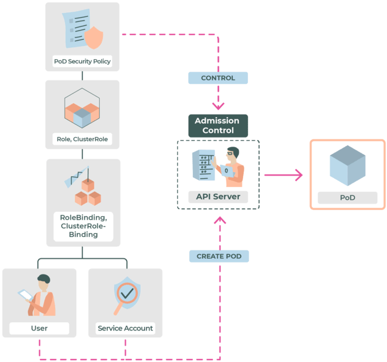

# 09_PSA -Pod Security Admission
在了解PSA之前，了解一下PSP（Pod Security Policy,自 Kubernetes v1.21 起，PSP 已弃用，未来会在 1.25 中移除。）
PSP是一种集群级别的全局资源，能够对Pod的创建和更新进行细粒度的授权控制。一个PSP对象定义了一组安全性条件，一个Pod的Spec字段必须满足这些条件以及适用相关字段的默认值，其创建或更新请求才会被api-server接受
## 启用PSP
Kubernetes默认不开启Pod安全策略功能，在集群中启用Pod安全策略步骤大致如下：
1. 在集群中创建指定的安全策略资源。
2. 通过RBAC机制授予**创建Pod的user**或者**被创建Pod的Service Account**使用安全策略资源的权限，通过会将使用权限授予一组useres或者service account
3. 启用api-server的admission-controlles插件
其中步骤1、2可以单独执行，不会对集群产生实际影响，但是步骤3在前两部之后执行。

一旦启用admission-controller插件，apiserver会对所有的Pod创建/更新请求强制执行安全策略检查，如果集群中没有可用的Pod安全策略资源或者未对安全策略资源预先授权，所有的Pod创建/更新请求都会被拒绝。包括kube-system命名空间下的系统管理组件。

启用的流程如下：


### 1.创建安全策略资源
```yaml

```

了解Pod安全性标准 [PSA安全策略详细内容](https://kubernetes.io/zh-cn/docs/concepts/security/pod-security-standards/)，以下内容摘自此

| **Profile**    | **描述**                                                             |
| :------------- | :------------------------------------------------------------------- |
| **Privileged** | 不受限制的策略，提供最大可能范围的权限许可。此策略允许已知的特权提升。     |
| **Baseline**   | 限制性最弱的策略，禁止已知的策略提升。允许使用默认的（规定最少）Pod 配置。 |
| **Restricted** | 限制性非常强的策略，遵循当前的保护 Pod 的最佳实践。                      |

## Profile细节
### Privileged[](#privileged)

**_Privileged_ 策略是有目的地开放且完全无限制的策略。** 此类策略通常针对由特权较高、受信任的用户所管理的系统级或基础设施级负载。

Privileged 策略定义中限制较少。默认允许的（Allow-by-default）实施机制（例如 gatekeeper） 可以缺省设置为 Privileged。 与此不同，对于默认拒绝（Deny-by-default）的实施机制（如 Pod 安全策略）而言， Privileged 策略应该禁止所有限制。

### Baseline[](#baseline)

**_Baseline_ 策略的目标是便于常见的容器化应用采用，同时禁止已知的特权提升。** 此策略针对的是应用运维人员和非关键性应用的开发人员。 下面列举的控制应该被实施（禁止）：

> **说明：**
在下述表格中，通配符（`*`）意味着一个列表中的所有元素。 例如 `spec.containers[*].securityContext` 表示**所定义的所有容器**的安全性上下文对象。 如果所列出的任一容器不能满足要求，整个 Pod 将无法通过校验。

<table><tbody><tr><td>控制（Control）</td><td>策略（Policy）</td></tr><tr><td>HostProcess</td><td><p>Windows Pod 提供了运行 <a href="https://kubernetes.io/zh-cn/docs/tasks/configure-pod-container/create-hostprocess-pod">HostProcess 容器</a> 的能力，这使得对 Windows 节点的特权访问成为可能。Baseline 策略中禁止对宿主的特权访问。</p><p><b>特性状态：</b> <code>Kubernetes v1.26 [stable]</code></p><p><strong>限制的字段</strong></p><ul><li><code>spec.securityContext.windowsOptions.hostProcess</code></li><li><code>spec.containers[*].securityContext.windowsOptions.hostProcess</code></li><li><code>spec.initContainers[*].securityContext.windowsOptions.hostProcess</code></li><li><code>spec.ephemeralContainers[*].securityContext.windowsOptions.hostProcess</code></li></ul><p><strong>准许的取值</strong></p><ul><li>未定义、nil</li><li><code>false</code></li></ul></td></tr><tr><td>宿主名字空间</td><td><p>必须禁止共享宿主上的名字空间。</p><p><strong>限制的字段</strong></p><ul><li><code>spec.hostNetwork</code></li><li><code>spec.hostPID</code></li><li><code>spec.hostIPC</code></li></ul><p><strong>准许的取值</strong></p><ul><li>未定义、nil</li><li><code>false</code></li></ul></td></tr><tr><td>特权容器</td><td><p>特权 Pod 会使大多数安全性机制失效，必须被禁止。</p><p><strong>限制的字段</strong></p><ul><li><code>spec.containers[*].securityContext.privileged</code></li><li><code>spec.initContainers[*].securityContext.privileged</code></li><li><code>spec.ephemeralContainers[*].securityContext.privileged</code></li></ul><p><strong>准许的取值</strong></p><ul><li>未定义、nil</li><li><code>false</code></li></ul></td></tr><tr><td>权能</td><td><p>必须禁止添加除下列字段之外的权能。</p><p><strong>限制的字段</strong></p><ul><li><code>spec.containers[*].securityContext.capabilities.add</code></li><li><code>spec.initContainers[*].securityContext.capabilities.add</code></li><li><code>spec.ephemeralContainers[*].securityContext.capabilities.add</code></li></ul><p><strong>准许的取值</strong></p><ul><li>未定义、nil</li><li><code>AUDIT_WRITE</code></li><li><code>CHOWN</code></li><li><code>DAC_OVERRIDE</code></li><li><code>FOWNER</code></li><li><code>FSETID</code></li><li><code>KILL</code></li><li><code>MKNOD</code></li><li><code>NET_BIND_SERVICE</code></li><li><code>SETFCAP</code></li><li><code>SETGID</code></li><li><code>SETPCAP</code></li><li><code>SETUID</code></li><li><code>SYS_CHROOT</code></li></ul></td></tr><tr><td>HostPath 卷</td><td><p>必须禁止 HostPath 卷。</p><p><strong>限制的字段</strong></p><ul><li><code>spec.volumes[*].hostPath</code></li></ul><p><strong>准许的取值</strong></p><ul><li>未定义、nil</li></ul></td></tr><tr><td>宿主端口</td><td><p>应该完全禁止使用宿主端口（推荐）或者至少限制只能使用某确定列表中的端口。</p><p><strong>限制的字段</strong></p><ul><li><code>spec.containers[*].ports[*].hostPort</code></li><li><code>spec.initContainers[*].ports[*].hostPort</code></li><li><code>spec.ephemeralContainers[*].ports[*].hostPort</code></li></ul><p><strong>准许的取值</strong></p><ul><li>未定义、nil</li><li>已知列表（不支持内置的 <a href="https://kubernetes.io/docs/concepts/security/pod-security-admission/">Pod 安全性准入控制器</a> ）</li><li><code>0</code></li></ul></td></tr><tr><td>AppArmor</td><td><p>在受支持的主机上，默认使用 <code>runtime/default</code> AppArmor 配置。Baseline 策略应避免覆盖或者禁用默认策略，以及限制覆盖一些配置集合的权限。</p><p><strong>限制的字段</strong></p><ul><li><code>metadata.annotations["container.apparmor.security.beta.kubernetes.io/*"]</code></li></ul><p><strong>准许的取值</strong></p><ul><li>未定义、nil</li><li><code>runtime/default</code></li><li><code>localhost/*</code></li></ul></td></tr><tr><td>SELinux</td><td><p>设置 SELinux 类型的操作是被限制的，设置自定义的 SELinux 用户或角色选项是被禁止的。</p><p><strong>限制的字段</strong></p><ul><li><code>spec.securityContext.seLinuxOptions.type</code></li><li><code>spec.containers[*].securityContext.seLinuxOptions.type</code></li><li><code>spec.initContainers[*].securityContext.seLinuxOptions.type</code></li><li><code>spec.ephemeralContainers[*].securityContext.seLinuxOptions.type</code></li></ul><p><strong>准许的取值</strong></p><ul><li>未定义、""</li><li><code>container_t</code></li><li><code>container_init_t</code></li><li><code>container_kvm_t</code></li></ul><hr class="simpread-hidden"><p><strong>限制的字段</strong></p><ul><li><code>spec.securityContext.seLinuxOptions.user</code></li><li><code>spec.containers[*].securityContext.seLinuxOptions.user</code></li><li><code>spec.initContainers[*].securityContext.seLinuxOptions.user</code></li><li><code>spec.ephemeralContainers[*].securityContext.seLinuxOptions.user</code></li><li><code>spec.securityContext.seLinuxOptions.role</code></li><li><code>spec.containers[*].securityContext.seLinuxOptions.role</code></li><li><code>spec.initContainers[*].securityContext.seLinuxOptions.role</code></li><li><code>spec.ephemeralContainers[*].securityContext.seLinuxOptions.role</code></li></ul><p><strong>准许的取值</strong></p><ul><li>未定义、""</li></ul></td></tr><tr><td><code>/proc</code>挂载类型</td><td><p>要求使用默认的 <code>/proc</code> 掩码以减小攻击面。</p><p><strong>限制的字段</strong></p><ul><li><code>spec.containers[*].securityContext.procMount</code></li><li><code>spec.initContainers[*].securityContext.procMount</code></li><li><code>spec.ephemeralContainers[*].securityContext.procMount</code></li></ul><p><strong>准许的取值</strong></p><ul><li>未定义、nil</li><li><code>Default</code></li></ul></td></tr><tr><td>Seccomp</td><td><p>Seccomp 配置必须不能显式设置为 <code>Unconfined</code>。</p><p><strong>限制的字段</strong></p><ul><li><code>spec.securityContext.seccompProfile.type</code></li><li><code>spec.containers[*].securityContext.seccompProfile.type</code></li><li><code>spec.initContainers[*].securityContext.seccompProfile.type</code></li><li><code>spec.ephemeralContainers[*].securityContext.seccompProfile.type</code></li></ul><p><strong>准许的取值</strong></p><ul><li>未定义、nil</li><li><code>RuntimeDefault</code></li><li><code>Localhost</code></li></ul></td></tr><tr><td>Sysctls</td><td><p>Sysctls 可以禁用安全机制或影响宿主上所有容器，因此除了若干 “安全” 的子集之外，应该被禁止。如果某 sysctl 是受容器或 Pod 的名字空间限制，且与节点上其他 Pod 或进程相隔离，可认为是安全的。</p><p><strong>限制的字段</strong></p><ul><li><code>spec.securityContext.sysctls[*].name</code></li></ul><p><strong>准许的取值</strong></p><ul><li>未定义、nil</li><li><code>kernel.shm_rmid_forced</code></li><li><code>net.ipv4.ip_local_port_range</code></li><li><code>net.ipv4.ip_unprivileged_port_start</code></li><li><code>net.ipv4.tcp_syncookies</code></li><li><code>net.ipv4.ping_group_range</code></li></ul></td></tr></tbody></table>


### Restricted[](#restricted)

**_Restricted_ 策略旨在实施当前保护 Pod 的最佳实践，尽管这样作可能会牺牲一些兼容性。** 该类策略主要针对运维人员和安全性很重要的应用的开发人员，以及不太被信任的用户。 下面列举的控制需要被实施（禁止）：

**说明：**

在下述表格中，通配符（`*`）意味着一个列表中的所有元素。 例如 `spec.containers[*].securityContext` 表示 **所定义的所有容器** 的安全性上下文对象。 如果所列出的任一容器不能满足要求，整个 Pod 将无法通过校验。

<table><tbody><tr><td><strong>控制</strong></td><td><strong>策略</strong></td></tr><tr><td colspan="2"><em>Baseline 策略的所有要求。</em></td></tr><tr><td>卷类型</td><td><p>除了限制 HostPath 卷之外，此类策略还限制可以通过 PersistentVolumes 定义的非核心卷类型。</p><p><strong>限制的字段</strong></p><ul><li><code>spec.volumes[*]</code></li></ul><p><strong>准许的取值</strong></p><code>spec.volumes[*]</code> 列表中的每个条目必须将下面字段之一设置为非空值：<ul><li><code>spec.volumes[*].configMap</code></li><li><code>spec.volumes[*].csi</code></li><li><code>spec.volumes[*].downwardAPI</code></li><li><code>spec.volumes[*].emptyDir</code></li><li><code>spec.volumes[*].ephemeral</code></li><li><code>spec.volumes[*].persistentVolumeClaim</code></li><li><code>spec.volumes[*].projected</code></li><li><code>spec.volumes[*].secret</code></li></ul></td></tr><tr><td>特权提升（v1.8+）</td><td><p>禁止（通过 SetUID 或 SetGID 文件模式）获得特权提升。<em><a href="#policies-specific-to-linux">这是 v1.25+ 中仅针对 Linux 的策略</a> <code>(spec.os.name != windows)</code></em></p><p><strong>限制的字段</strong></p><ul><li><code>spec.containers[*].securityContext.allowPrivilegeEscalation</code></li><li><code>spec.initContainers[*].securityContext.allowPrivilegeEscalation</code></li><li><code>spec.ephemeralContainers[*].securityContext.allowPrivilegeEscalation</code></li></ul><p><strong>允许的取值</strong></p><ul><li><code>false</code></li></ul></td></tr><tr><td>以非 root 账号运行</td><td><p>容器必须以非 root 账号运行。</p><p><strong>限制的字段</strong></p><ul><li><code>spec.securityContext.runAsNonRoot</code></li><li><code>spec.containers[*].securityContext.runAsNonRoot</code></li><li><code>spec.initContainers[*].securityContext.runAsNonRoot</code></li><li><code>spec.ephemeralContainers[*].securityContext.runAsNonRoot</code></li></ul><p><strong>准许的取值</strong></p><ul><li><code>true</code></li></ul><small>如果 Pod 级别 <code>spec.securityContext.runAsNonRoot</code> 设置为 <code>true</code>，则允许容器组的安全上下文字段设置为 未定义 /<code>nil</code>。</small></td></tr><tr><td>非 root 用户（v1.23+）</td><td><p>容器不可以将 <tt>runAsUser</tt> 设置为 0</p><p><strong>限制的字段</strong></p><ul><li><code>spec.securityContext.runAsUser</code></li><li><code>spec.containers[*].securityContext.runAsUser</code></li><li><code>spec.initContainers[*].securityContext.runAsUser</code></li><li><code>spec.ephemeralContainers[*].securityContext.runAsUser</code></li></ul><p><strong>准许的取值</strong></p><ul><li>所有的非零值</li><li><code>undefined/null</code></li></ul></td></tr><tr><td>Seccomp (v1.19+)</td><td><p>Seccomp Profile 必须被显式设置成一个允许的值。禁止使用 <code>Unconfined</code> Profile 或者指定 <em>不存在的</em> Profile。<em><a href="#policies-specific-to-linux">这是 v1.25+ 中仅针对 Linux 的策略</a> <code>(spec.os.name != windows)</code></em></p><p><strong>限制的字段</strong></p><ul><li><code>spec.securityContext.seccompProfile.type</code></li><li><code>spec.containers[*].securityContext.seccompProfile.type</code></li><li><code>spec.initContainers[*].securityContext.seccompProfile.type</code></li><li><code>spec.ephemeralContainers[*].securityContext.seccompProfile.type</code></li></ul><p><strong>准许的取值</strong></p><ul><li><code>RuntimeDefault</code></li><li><code>Localhost</code></li></ul><small>如果 Pod 级别的 <code>spec.securityContext.seccompProfile.type</code> 已设置得当，容器级别的安全上下文字段可以为未定义 /<code>nil</code>。 反之如果 <bold>所有的</bold> 容器级别的安全上下文字段已设置， 则 Pod 级别的字段可为 未定义 /<code>nil</code>。</small></td></tr><tr><td>权能（v1.22+）</td><td><p>容器必须弃用 <code>ALL</code> 权能，并且只允许添加 <code>NET_BIND_SERVICE</code> 权能。<em><a href="#policies-specific-to-linux">这是 v1.25+ 中仅针对 Linux 的策略</a> <code>(.spec.os.name != "windows")</code></em></p><p><strong>限制的字段</strong></p><ul><li><code>spec.containers[*].securityContext.capabilities.drop</code></li><li><code>spec.initContainers[*].securityContext.capabilities.drop</code></li><li><code>spec.ephemeralContainers[*].securityContext.capabilities.drop</code></li></ul><p><strong>准许的取值</strong></p><ul><li>包括 <code>ALL</code> 在内的任意权能列表。</li></ul><hr class="simpread-hidden"><p><strong>限制的字段</strong></p><ul><li><code>spec.containers[*].securityContext.capabilities.add</code></li><li><code>spec.initContainers[*].securityContext.capabilities.add</code></li><li><code>spec.ephemeralContainers[*].securityContext.capabilities.add</code></li></ul><p><strong>准许的取值</strong></p><ul><li>未定义、nil</li><li><code>NET_BIND_SERVICE</code></li></ul></td></tr></tbody></table>

策略实例化[](#policy-instantiation)
------------------------------

将策略定义从策略实例中解耦出来有助于形成跨集群的策略理解和语言陈述， 以免绑定到特定的下层实施机制。

随着相关机制的成熟，这些机制会按策略分别定义在下面。特定策略的实施方法不在这里定义。

# Pod 安全性准入
上述Pod安全性标准，为Pod定义了不同的隔离级别。这些标准能够以一种清晰、一致的方式定义Pod行为。
K8S提供了内置的Pod Security准入控制器（v1.24及以后）来执行Pod安全标准。创建Pod时在namespace级别应用这些Pod安全限制

为Namespace设置Pod安全性准入控制标签
