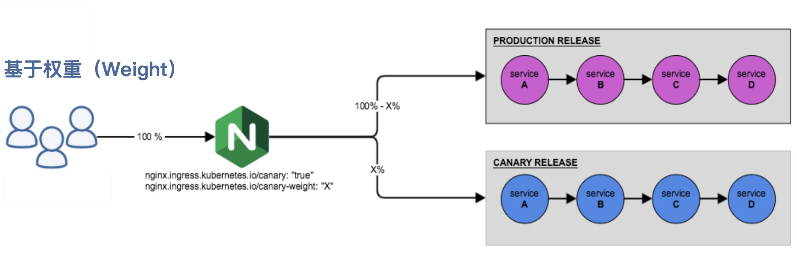
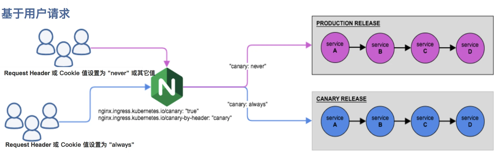

# 12_ingress
# 使用yaml文件安装nginx-ingress
需要修改的地方：
1.镜像地址
2.service
externalTrafficPolicy: Cluster 流量可以转发到其他的pod
externalIPs: ['192.168.127.200'] （后面的IP是和nodeIP一个局域网的地址），如果节点不在外网拥有域名的话，可以通过设置的IP将集群外部流量转发到集群内部来


service除了LoadBalancer，还可以使用nodeport和hostNetwork（这种就不需要svc了），如果使用hostNetwork，尽量将control指定到某一个节点上，同时设置toleration

另外还可以使用daemonset，这种情况下K8S默认不会将pod调度到master节点，如果需要的话，在yaml文件中需要设置tolerations，hostnetwork为true

相比较起来，nodePort部署模式中需要部署的ingress-controller容器较少。一个集群可以部署几个就可以了。而hostNetwork模式需要在每个节点部署一个ingress-controller容器，因此总起来消耗资源较多。另外一个比较直观的区别，nodePort模式主要占用的是svc的nodePort端口。而hostNetwork则需要占用物理机的80和443端口。

从网络流转来说，通过nodePort访问时，该node节点不一定部署了ingress-controller容器。因此还需要iptables将其转发到部署有ingress-controller的节点上去，多了一层流转。

另外，通过nodePort访问时，nginx接收到的http请求中的source ip将会被转换为接受该请求的node节点的ip，而非真正的client端ip。

而使用hostNetwork的方式，ingress-controller将会使用的是物理机的DNS域名解析(即物理机的/etc/resolv.conf)。而无法使用内部的比如coredns的域名解析。

因此具体使用哪种部署方式，需要根据实际情况和需求进行选择。

## 单域名不支持子URL：
```sh
kubectl create ingress my-nginx --rule="www.ning.org/=my-nginx:80" --class=nginx
```
```yaml
apiVersion: networking.k8s.io/v1
kind: Ingress
metadata:
  name: my-nginx
  labels:
    name: my-nginx
spec:
  ingressClassName: nginx
  rules:
  - host: www.ning.org
    http:
      paths:
      - path: /
        pathType: Exact # 这里
        backend:
          service:
            name: my-nginx
            port:
              number: 80
```
## 单域名支持子URL：
```sh
kubectl create ingress my-nginx --rule="www.ning.org/*=my-nginx:80" --class=nginx
```

```yaml
apiVersion: networking.k8s.io/v1
kind: Ingress
metadata:
  name: my-nginx
  labels:
    name: my-nginx
spec:
  ingressClassName: nginx
  rules:
  - host: www.ning.org
    http:
      paths:
      - path: /
        pathType: Prefix # 这里
        backend:
          service:
            name: my-nginx
            port:
              number: 80
```
## 单域名多URL不支持子URL
```sh
kubectl create ingress my-nginx --rule="www.ning.org/server1/*=my-nginx:80" --rule="www.ning.org/server2/*=ng-svc2:80" --class=nginx
```
```yaml
apiVersion: networking.k8s.io/v1
kind: Ingress
metadata:
  name: my-nginx
spec:
  ingressClassName: nginx
  rules:
  - host: www.ning.org
    http:
      paths:
      - backend:
          service:
            name: my-nginx
            port:
              number: 80
        path: /s1
        pathType: Exact
      - backend:
          service:
            name: ng-svc2
            port:
              number: 80
        path: /s2
        pathType: Exact  #是否支持子URL就看这个 如果是Excat 就不支持
status:
  loadBalancer: {}
```
上面会失败，因为他其实是访问的后端服务的s1\s2，而不是ingress的s1\s2，需要路径精确匹配，对于发往s1和s2的请求，分别代理至两个service的根
```sh
kubectl create -ingress my-nginx --rule="www.ning.org/server1*=my-nginx:80" --rule="www.ning.org/server2*=ng-svc2:80" --class=nginx  --annotation nginx.ingress.kubernetes.io/rewrite-target="/"
```
```yaml
apiVersion: networking.k8s.io/v1
kind: Ingress
metadata:
  annotations:
    nginx.ingress.kubernetes.io/rewrite-target: /
  creationTimestamp: null
  name: my-nginx
spec:
  ingressClassName: nginx
  rules:
  - host: www.ning.org
    http:
      paths:
      - backend:
          service:
            name: my-nginx
            port:
              number: 80
        path: /server1
        pathType: Prefix
      - backend:
          service:
            name: ng-svc2
            port:
              number: 80
        path: /server2
        pathType: Prefix
status:
  loadBalancer: {}
  
```

`--annotation nginx.ingress.kubernetes.io/rewrite-target="/"`就是表示代理至后端服务的根，而不是后端服务的子URL了。
但是i这样子就不能实现子URL了
## 单域名多URL支持子URL
使用URI的前缀匹配，而非精确匹配，且基于正则表达式模式进行url rewrite
```sh
kubectl create ingress my-nginx --rule='www.ning.org/v1(/|$)(.*)=my-nginx:80' --rule='www.ning.org/v2(/|$)(.*)=ng-svc2:80' --class=nginx --annotation nginx.ingress.kubernetes.io/rewrite-target='/$2'
```
注意 ，target必须是'/$2'
```yaml
apiVersion: networking.k8s.io/v1
kind: Ingress
metadata:
  annotations:
    nginx.ingress.kubernetes.io/rewrite-target: /$2
  name: my-nginx
spec:
  ingressClassName: nginx
  rules:
  - host: www.ning.org
    http:
      paths:
      - backend:
          service:
            name: my-nginx
            port:
              number: 80
        path: /s1(/|$)(.*)
        pathType: Exact
      - backend:
          service:
            name: ng-svc2
            port:
              number: 80
        path: /s2(/|$)(.*)
        pathType: Exact
status:
  loadBalancer: {}

```
```sh
kubectl create ingress my-nginx --rule="www.ning.org/*=my-nginx:80"   --rule="test.qqq.com/*=ng-svc2:80" --class=nginx

```


# 实现HTTPS
```shell
(umask 077;openssl genrsa -out go189.key 2048)
openssl req -new -x509 -key go189.key -out go189.crt -subj /C=CN/ST=Beijin/L=Beijing/O=SRE/CN=www.go189.cn -days 365
创建secret
kubectl create secret tls tls-xaby --cert=./go189.crt --key=./go189.key

kubectl get secrets
kubectl describe secrets tls-xaby

#查看证书相关信息
openssl x509 -in go189.crt
openssl x509 -in go189.crt --noout -dates
 
# 创建https的代理
kubectl create ingress ingress-demo-tls --rule="www.go189.cn/*=my-nginx:80,tls=tls-go189" -class=nginx
# 注意 启用tls后，该域名下的所有URL默认强制将http请求重定向到https，如果不希望启用这个功能，需要加上如下配置
kubectl create ingress ingress-demo-tls --rule="www.go189.cn/*=my-nginx:80,tls=tls-go189" --class=nginx --annotation=nginx.ingress.kubernetes.io/ssl-redirect=false


证书验证
openssl s_client -servername www.go189.cn -connect 192.168.127.200:443

```


证书更新
```shell
重新颁发证书
(umask 077;openssl genrsa -out go189.key 2048)
openssl req -new -x509 -key go189.key -out go189.crt -subj /C=CN/ST=Beijin/L=Beijing/O=SRE/CN=www.go189.cn -days 3650

方法1
修改secret配置
1.证书编码并删除换行
cat go189.crt | base64 | tr -d '\n'
cat go189.key | base64 | tr -d '\n'
2.将编码后端内容替换
kubectl edit secrets tls-go189

方法2
删除旧的证书配置
kubectl delete secrets tls-go189
创建新的证书配置
kubectl create secrets tls tls-go189 --cert=./go189.cert --key=./go189.key
```


# 灰度发布
# 注意测试的时候 同一个svc，或者同一个deployment只能用一个ingress的灰度发布，不然endpoints可能会有问题，后续排查
ingress-nginx 支持通过 Annotations 配置来实现不同场景下的灰度发布和测试。
金丝雀规则按优先顺序进行排序：canary-by-header - > canary-by-cookie - > canary-weight
- 基于权重的 Canary 规则

- 基于用户请求的 Canary 规则


## 灰度发布有四种
- nginx.ingress.kubernetes.io/canary-by-weight
- nginx.ingress.kubernetes.io/canary-by-header
- nginx.ingress.kubernetes.io/canary-by-header-value
- nginx.ingress.kubernetes.io/canary-by-cookie

## ex:
创建一个可以输出host信息的deploymen对应server以及ingress,这里找了网上一个echoServer的包
```yaml
apiVersion: apps/v1
kind: Deployment
metadata:
  name: echoserver-prod
spec:
  replicas: 5
  selector:
    matchLabels:
      app: echoserver-prod
  template:
    metadata:
      labels:
        app: echoserver-prod
    spec:
      containers:
      - image: ealen/echo-server:latest
        imagePullPolicy: IfNotPresent
        name: echoserver-prod
        ports:
        - containerPort: 80
        env:
        - name: PORT
          value: "80"
---
apiVersion: v1
kind: Service
metadata:
  name: echoserver-prod
spec:
  ports:
    - port: 80
      targetPort: 80
      protocol: TCP
  type: ClusterIP
  selector:
    app: echoserver-prod
---
apiVersion: networking.k8s.io/v1
kind: Ingress
metadata:
  name: echoserver-prod
spec:
  ingressClassName: nginx
  rules:
  - host: echo.ning.org
    http:
      paths:
      - path: /
        pathType: Prefix
        backend:
          service:
            name: echoserver-prod
            port:
              number: 80

```

然后创建新的deploy和service，
```yaml

apiVersion: apps/v1
kind: Deployment
metadata:
  name: echoserver-canary
spec:
  replicas: 5
  selector:
    matchLabels:
      app: echoserver-canary
  template:
    metadata:
      labels:
        app: echoserver-canary
    spec:
      containers:
      - image: ealen/echo-server:latest
        imagePullPolicy: IfNotPresent
        name: echoserver-canary
        ports:
        - containerPort: 80
        env:
        - name: PORT
          value: "80"
---
apiVersion: v1
kind: Service
metadata:
  name: echoserver-canary
spec:
  ports:
    - port: 80
      targetPort: 80
      protocol: TCP
  type: ClusterIP
  selector:
    app: echoserver-canary
```
接下来就可以通过配置 Annotation 规则进行流量切分了。

### nginx.ingress.kubernetes.io/canary-by-weight
第三步. Annotation 规则配置,
```shell
apiVersion: networking.k8s.io/v1
kind: Ingress
metadata:
  name: echoserver-canary
  # 这里就是分流规则
  annotations:
    nginx.ingress.kubernetes.io/canary: "true"
    nginx.ingress.kubernetes.io/canary-weight: "30"
spec:
  ingressClassName: nginx
  rules:
  - host: echo.ning.org
    http:
      paths:
      - path: /
        pathType: Prefix
        backend:
          service:
            name: echoserver-canary
            port:
              number: 80
```
### nginx.ingress.kubernetes.io/canary-by-header


### 验证命令
```shell
for i in $(seq 1 10 ) ;do curl -s -b "xaby_test_dev=never" cookie.ning.org | grep  'Hostname' ; done
for i in $(seq 1 10 ) ;do curl -s -H "test: never" header.ning.org | grep  'Hostname' ; done
```


# 证书管理 cert-manager
安装cert-manager
```shell
https://cert-manager.io/docs/installation/
```

## 使用cert-manager
首先验证测试一下是否可以签发基本的证书类型。创建一个Issuer资源对象来测试webhook工作是否正常（在开始签发证书之前，必须在集群中至少配置一个Issuer或者ClusterIssuer资源

```yaml
apiVersion: v1
kind: Namespace
metadata:
  name:  cert-manager-test
---
apiVersion: cert-manager.io/v1
kind: Issuer
metadata:
  name: test-selfsigned
  namespace: cert-manager-test
spec:
  selfSigned: {}
---
apiVersion: cert-manager.io/v1
kind: Certificate
metadata:
  name: selfsigned-cert
  namespace: cert-manager-test
spec:
  dnsNames:
    - www.go189.cn
  secretName: selfsigned-cert-tls
  issuerRef:
    name: test-selfsigned
```
### 自动化HTTPS
Let’s Encrypt 利用 ACME 协议来校验域名是否真的属于你，校验成功后就可以自动颁发免费证书，证书有效期只有 90 天，在到期前需要再校验一次来实现续期，幸运的是 cert-manager 可以自动续期，这样就可以使用永久免费的证书了。如何校验这个域名是否属于你呢？主流的两种校验方式是 HTTP-01 和 DNS-01
### HTTP-01 校验原理
HTTP-01 的校验原理是给你域名指向的 HTTP 服务增加一个临时 location ，Let’s Encrypt 会发送 http 请求到 http://YOUR_DOMAIN/.well-known/acme-challenge/，YOUR_DOMAIN 就是被校验的域名，TOKEN 是 ACME 协议的客户端负责放置的文件，在这里 ACME 客户端就是 cert-manager，它通过修改或创建 Ingress 规则来增加这个临时校验路径并指向提供 TOKEN 的服务。Let’s Encrypt 会对比 TOKEN 是否符合预期，校验成功后就会颁发证书。此方法仅适用于给使用 Ingress 暴露流量的服务颁发证书，并且不支持泛域名证书。
### DNS-01 校验原理
DNS-01 的校验原理是利用 DNS 提供商的 API Key 拿到你的 DNS 控制权限， 在 Let’s Encrypt 为 ACME 客户端提供令牌后，ACME 客户端 (cert-manager) 将创建从该令牌和您的帐户密钥派生的 TXT 记录，并将该记录放在 _acme-challenge.。 然后 Let’s Encrypt 将向 DNS 系统查询该记录，如果找到匹配项，就可以颁发证书。此方法不需要你的服务使用 Ingress，并且支持泛域名证书。
### 对比
HTTP-01 的校验方式的优点是: 配置简单通用，不管使用哪个 DNS 提供商都可以使用相同的配置方法；缺点是：需要依赖 Ingress，如果你的服务不是用 Ingress 暴露流量的就不适用，而且不支持泛域名证书。

DNS-01 的校验方式的优点是没有 HTTP-01 校验方式缺点，不依赖 Ingress，也支持泛域名；缺点就是不同 DNS 提供商的配置方式不一样，而且 DNS 提供商有很多，cert-manager 的 Issuer 不可能每个都去支持，不过有一些可以通过部署实现了 cert-manager 的 Webhook 的服务来扩展 Issuer 进行支持，比如 DNSPod 和 阿里 DNS，详细 Webhook 列表请参考: https://cert-manager.io/docs/configuration/acme/dns01/#webhook

选择哪种方式呢？条件允许的话，建议是尽量用 DNS-01 的方式，限制更少，功能更全。

