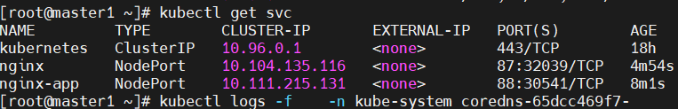
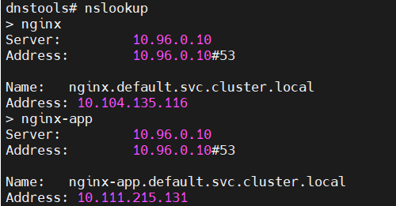
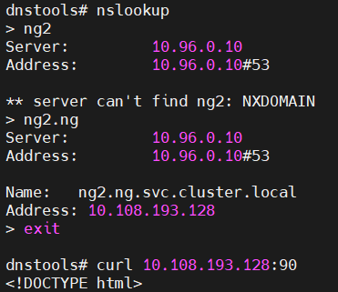
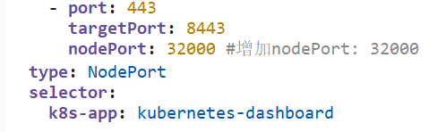

# K8S
## CoreDNS验证

在节点中起一个DNS-TOOLS的容器
`kubectl run -it --rm --restart=Never --image=infoblox/dnstools:latest dnstools`
新建一个窗口，在新的窗口创建一个nginx的deployment
`kubectl create deploymen nginx-app --image=nginx --replicas=2`
看下svc
`kubectl get svc`
新建的nginx没有，创建一个`kubectl expose deployment nginx-app --port=88 --target-port=80 --type=NodePort`,查看svc情况


svc正常，开始测试dns情况
在第一个终端输入nslookup,指定svc中的name，查看是否能够输出对应的IP

没有问题
如果发现问题，可以看一下coredns的pod`kubectl logs -n kube-system -f coredns-***`日志的报错，觉得没有什么问题，可以重新启动一些coredns`kubectl delete pod -n kube-system coredns-****`

不同的命令空间中可以互相访问，但是解析不成功，可以带一下命名空间

## Dashboard部署
访问官方网站的[教程文档](https://kubernetes.io/zh-cn/docs/tasks/access-application-cluster/web-ui-dashboard/)，将yaml文件下载下来，需要改一点配置

增加nodePort,以及修改type

- 部署
`kubectl create -f recommended.yaml`
使用浏览器打开任意服务器IP加32000端口，即可进入dashboard

- 创建用户授权
```
kubectl create serviceaccount dashboard-admin -n kubernetes-dashboard
kubectl create clusterrolebinding dashboard-admin --clusterrole=cluster-admin --serviceaccount=kubernetes-dashboard:dashboard-admin
```
- 获取token[官方文档](https://github.com/kubernetes/dashboard/blob/master/docs/user/access-control/creating-sample-user.md)
`kubectl -n kubernetes-dashboard create token dashboard-admin`
将生产的token复制到dashboard面板中

# Ingress 
- 使用traefik-ingress
```
kubectl create -f crd.yaml
kubectl create -f rbac.yaml
kubectl create -f traefik-config.yaml
```
- 设置节点标签(127.20、127.40)
```
kubectl label nodes master2 IngressProxy=true
kubectl label nodes node1 IngressProxy=true

#查看标签
kubectl get nodes --show-labels

```
- 创建